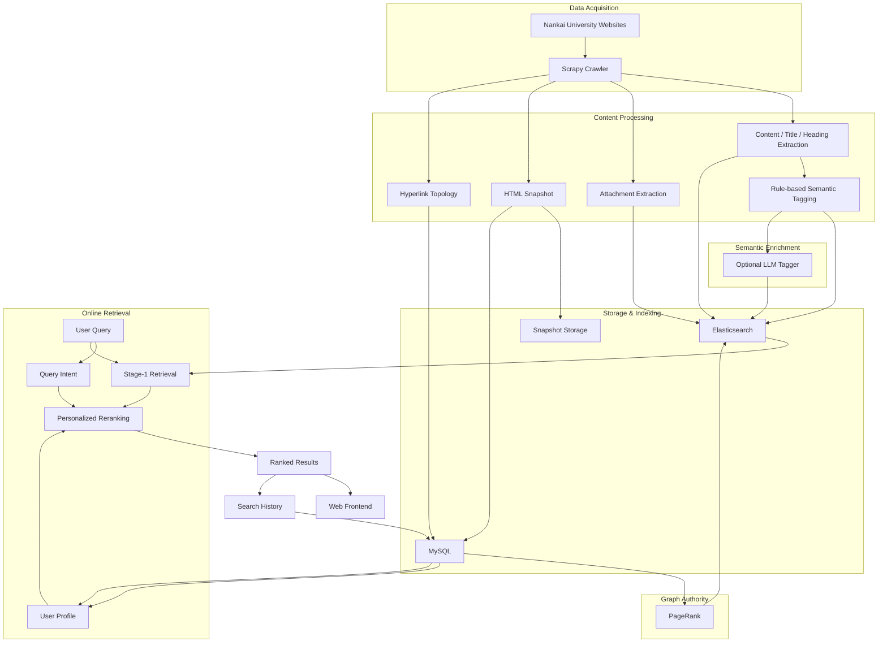

# NKU Personalized Information Retrieval & Recommendation System

> A personalized vertical search and recommendation system for Nankai University resources, integrating web crawling, Elasticsearch retrieval, PageRank, structured user modeling, semantic tagging, adaptive personalization, query assistance, and graph-based administration.

This project was originally developed as a course project on information retrieval and recommendation systems.

Instead of building only a keyword-based campus search engine, the system explores a broader question:

> **How can heterogeneous university resources be retrieved and ranked according to both query relevance and individual user context?**

The final system constructs a complete pipeline from data acquisition to personalized ranking:

**Web Crawling → Content Processing → Semantic Tagging → Elasticsearch Indexing → PageRank → Query Understanding → User Modeling → Personalized Reranking**

---

## Overview

University information is distributed across many independent websites:

* university portals
* schools and departments
* academic and research platforms
* administrative services
* enrollment and employment websites
* student services
* laboratories and research centers

These resources differ substantially in site structure, authority, topic, intended audience, and relevance to different users.

A Computer Science undergraduate searching for:

> `科研`

should not necessarily receive exactly the same ranking as a student from another discipline.

Likewise, explicit queries such as:

> `计算机学院科研`

should override generic historical preferences and strongly emphasize the user's current search intent.

This project therefore models retrieval as a combination of:

$$
\text{Query Relevance}
+
\text{Page Authority}
+
\text{Query Semantics}
+
\text{User Context}
+
\text{Exact Matching}
$$

rather than relying on a single retrieval score.

---

# Key Features

### Information Retrieval

* Full-text retrieval with Elasticsearch
* Multiple search modes:

  * standard site search
  * phrase search
  * wildcard search
  * document / attachment search
* Title and content field boosting
* Search-result highlighting
* Exact-title matching
* Query-aware reranking

### Personalized Recommendation & Ranking

* User cold-start profile
* Role-aware personalization
* College / discipline-aware personalization
* Explicit interest modeling
* Search-history-based preference adaptation
* Query-dependent personalization strength
* Hierarchical college and discipline relations

### PageRank & Site Topology

* Directed hyperlink graph construction
* PageRank authority estimation
* PageRank synchronization into Elasticsearch
* Interactive D3 site-topology visualization
* Macro-domain → page-level drill-down

### Semantic Understanding

* Rule-based page classification
* Structured tag taxonomy
* Query intent detection
* Confidence-aware tags
* Optional LLM-assisted page tagging
* Rule + LLM hybrid semantic enrichment

### Query Assistance

* Search history suggestions
* Popular-query suggestions
* Prefix completion
* Chinese tokenization
* Fuzzy matching
* Spelling correction
* Query continuation prediction

### Data & Backend

* FastAPI backend
* Elasticsearch full-text index
* MySQL relational data model
* Transactions
* Foreign-key constraints
* Triggers
* Stored procedures
* Web-page snapshots
* Administrative data views

---

# System Architecture



---

# 1. Web Crawling and Resource Construction

The crawler is implemented with **Scrapy** and starts from major Nankai University websites across academic schools, administrative departments, research platforms, student services, and other university resources.

The crawler is restricted to the `nankai.edu.cn` domain family.

For each page, the system extracts:

* URL
* page title
* cleaned textual content
* headings
* downloadable attachments
* attachment names
* outgoing hyperlinks
* raw HTML
* page-level semantic features

Non-content elements such as:

* scripts
* styles
* navigation bars
* headers
* footers

are filtered before indexing.

The system also detects downloadable resources including:

`PDF · DOC/DOCX · XLS/XLSX · PPT/PPTX · TXT · CSV · ZIP`

---

## Multi-Target Data Pipeline

A crawled page is not stored in only one place.

The pipeline generates three complementary representations:

```text
                    Crawled Page
                         |
            +------------+-------------+
            |            |             |
            v            v             v
      HTML Snapshot  Elasticsearch   MySQL
                         |             |
                         |             +-- Page metadata
                         |             +-- Link topology
                         |
                         +-- Content
                         +-- Title
                         +-- Attachments
                         +-- Semantic tags
                         +-- PageRank
```

### Elasticsearch

Stores information required for online retrieval:

* title
* content
* attachments
* semantic tags
* tag confidence
* crawl time
* PageRank

### MySQL

Stores relational and behavioral information:

* users
* user profiles
* preferences
* search logs
* page metadata
* page-link topology
* college-domain mappings

### Snapshot Storage

The original page is transformed into a local snapshot with:

* crawl timestamp
* original-page link
* repaired relative resource paths
* scripts removed for safer local rendering

Users can therefore inspect the version of a page that was indexed by the search system.

---

# 2. Semantic Resource Representation

One of the central problems in university-wide search is that keyword relevance alone does not capture the organizational structure of university information.

The project therefore defines a structured semantic taxonomy.

## Organizational Hierarchy

```text
macro
└── discipline group
    └── college
```

Examples:

```text
理工医学类
└── 信息科学群
    ├── 计算机学院
    ├── 软件学院
    ├── 密码与网络空间安全学院
    └── 人工智能学院
```

The system currently models dimensions including:

### Organizational dimensions

* `college`
* `macro`
* `group`

### Content dimensions

* `topic`
* `page_type`
* `audience`
* `intent`

Examples of topic labels include:

* academic research
* teaching
* admissions and employment
* student affairs
* lectures
* competitions
* research results
* laboratories
* regulations
* campus services

---

# 3. Hybrid Semantic Tagging

Semantic classification is designed as a **rule-first, optionally LLM-assisted pipeline**.

## Rule-Based Layer

The first layer uses interpretable information such as:

* page domain
* title
* page content
* headings
* keyword matches
* known college-domain mappings

to produce structured tags with confidence values.

Example:

```json
{
  "namespace": "college",
  "value": "计算机学院",
  "confidence": 0.95,
  "source": "rule"
}
```

This design has two advantages:

1. high-confidence organizational knowledge does not require an LLM call;
2. ranking decisions remain partially interpretable.

---

## Optional LLM Enrichment

For ambiguous pages, the system supports an optional LLM-based semantic classifier.

The LLM receives:

* URL
* title
* content snippet
* headings
* rule-generated candidate tags
* predefined taxonomy

and returns structured tags with confidence scores.

The final representation merges rule and LLM outputs while filtering low-confidence predictions.

The objective is therefore not:

```text
LLM replaces all rules
```

but:

```text
Deterministic structural knowledge
            +
LLM semantic generalization
            ↓
Hybrid semantic representation
```

---

# 4. PageRank and University Site Authority

Keyword relevance alone does not distinguish an authoritative portal from a relatively isolated page.

During crawling, every hyperlink is recorded as a directed edge:

$$
(u,v)
$$

where page \(u\) links to page \(v\).

These edges form a directed graph:

$$
G=(V,E)
$$

The project computes PageRank with damping factor:

$$
\alpha = 0.85
$$

using:

$$
PR(v)
=
\frac{1-\alpha}{|V|}
+
\alpha
\sum_{u\in In(v)}
\frac{PR(u)}{OutDegree(u)}
$$

The resulting authority score is synchronized back into Elasticsearch.

Therefore:

```text
Crawler
   ↓
PageLinks
   ↓
Directed Graph
   ↓
PageRank
   ↓
Elasticsearch
   ↓
Retrieval Ranking
```

PageRank is used as an **authority prior**, complementing textual relevance.

---

# 5. Two-Stage Retrieval

The search engine uses a two-stage architecture.

```text
Query
  ↓
Stage 1: Elasticsearch Candidate Retrieval
  ↓
Top-K Candidate Set
  ↓
Stage 2: Multi-Signal Personalized Reranking
  ↓
Final Results
```

---

## Stage 1 — Candidate Retrieval

Elasticsearch retrieves up to a candidate set of pages using textual relevance and authority information.

Standard site search uses fields approximately equivalent to:

```text
title^2
content
```

Additional signals include:

* title phrase match
* title token match
* content phrase match
* PageRank
* special handling for highly precise university-navigation queries

Other supported modes include:

### Phrase Search

Preserves term order and adjacency.

### Wildcard Search

Supports pattern-based matching.

### Document Search

Searches pages containing downloadable resources and includes attachment names in retrieval.

---

# 6. Personalized Reranking

The second stage performs a more explicit fusion of ranking signals.

For each candidate page, the implementation derives:

* \(R\): Elasticsearch relevance
* \(P\): PageRank authority
* \(U\): user-profile compatibility
* \(Q\): query-tag / page-tag compatibility
* \(E\): exact-match score

After normalization, the ranking implementation can be summarized as:

$$
S(d,q,u)
=
0.48R
+
0.13P
+
0.22A(q,u)U
+
0.16Q
+
0.17E
+
B_{exact}
$$

where:

* \(d\) is a candidate document,
* \(q\) is the query,
* \(u\) is the user,
* \(A(q,u)\) controls how strongly personalization should influence this query,
* \(B_{exact}\) is an additional bonus for strong exact matches.

The coefficients are heuristic tuning coefficients rather than a probabilistic mixture.

---

## Why Query-Dependent Personalization?

A central design problem is avoiding over-personalization.

Suppose a Computer Science student searches:

> `历史学院`

The system should not aggressively push Computer Science pages merely because the user belongs to the Computer Science school.

Therefore personalization is modulated by **query affinity**.

Conceptually:

$$
PersonalizationContribution
=
UserPreference
\times
QueryAffinity
$$

For explicit subject queries, the implementation further reduces generic profile influence so that:

$$
\text{Current Intent}
>
\text{Historical Preference}
$$

This is an important design principle of the system:

> **Personalization should assist the current information need rather than override it.**

---

# 7. User Modeling

The system models users using both static and dynamic information.

## Static Profile

During cold start, users may provide:

* identity / role

  * undergraduate
  * graduate student
  * faculty
  * visitor
* college
* initial interests

This creates an initial user representation before enough behavioral data are available.

---

## Hierarchical Academic Context

A user's college is mapped into a university hierarchy.

For example:

```text
User
 ↓
College
 ↓
Discipline Group
 ↓
Macro Category
```

The system can therefore distinguish between:

1. the user's own college;
2. closely related colleges in the same discipline group;
3. colleges in the same macro discipline;
4. unrelated colleges.

This produces a smoother personalization model than a binary:

```text
same college / different college
```

representation.

---

## Dynamic Preference Modeling

Search history is continuously recorded.

The system extracts the dominant category from recent user behavior and updates the corresponding preference weight.

A simplified update follows:

$$
w_{t+1}
=
w_t
+
0.1(2-w_t)
$$

This gradually moves repeated preferences toward an upper target rather than increasing them without bound.

Therefore the profile contains both:

$$
\text{Explicit Preferences}
+
\text{Implicit Behavioral Feedback}
$$

---

# 8. Personalization Context

For each logged-in search, a contextual user representation is constructed from:

```text
User Role
+
College
+
Discipline Group
+
Macro Discipline
+
Explicit Interests
+
Dynamic Preference Weights
+
Recent Queries
+
Current Query Intent
```

This context is converted into structured tag weights and used during reranking.

For example:

```text
User: Computer Science undergraduate
Interest: Academic Research
Recent Search: Machine Learning Seminar

                ↓

college:计算机学院
group:信息科学群
macro:理工医学类
topic:学术
...
```

Pages sharing relevant semantic tags receive additional compatibility scores.

---

# 9. Query Understanding

The query itself is also represented semantically.

For example:

```text
"计算机学院科研"
```

may generate a structured query profile such as:

```text
college: 计算机学院
group:   信息科学群
macro:   理工医学类
topic:   学术
```

Query intent detection is again implemented using a hybrid strategy.

### High-confidence query

Handled directly by deterministic rules.

### Ambiguous query

Can optionally invoke LLM-based query-intent analysis.

This representation is compared against page tags during reranking.

A simplified compatibility function is:

$$
Match(q,d)
=
\sum_t
Conf_q(t)
\cdot
Conf_d(t)
\cdot
\left(1+\lambda W_u(t)\right)
$$

where:

* \(Conf_q(t)\): confidence that tag \(t\) describes the query;
* \(Conf_d(t)\): confidence that tag \(t\) describes the page;
* \(W_u(t)\): user preference associated with the tag.

This connects:

**Query Understanding + Document Understanding + Personalization**

inside a single ranking process.

---

# 10. Query Suggestion & Correction

The system also implements a query-assistance subsystem.

Its vocabulary combines:

* static university terms
* Elasticsearch page titles
* popular historical queries
* college names
* cached page titles

A prefix index is built for fast completion.

The system supports:

### Prefix Completion

```text
计算
↓
计算机学院
```

### Search History

Logged-in users receive recent-query suggestions.

### Popular Queries

Global search frequency provides fallback suggestions.

### Fuzzy Matching

`RapidFuzz` is used when available, with `difflib` as a fallback.

### Chinese Query Processing

`jieba` is used for Chinese tokenization when appropriate.

The objective is to combine:

$$
\text{Personal History}
+
\text{Global Popularity}
+
\text{Corpus Vocabulary}
+
\text{Approximate Matching}
$$

for query assistance.

---

# 11. Database Design

The relational database is not used merely for account authentication.

It supports the personalization and retrieval pipeline.

Core tables include:

| Table            | Responsibility                 |
| ---------------- | ------------------------------ |
| `User`           | account information            |
| `UserProfile`    | role and college profile       |
| `UserPreference` | dynamic interest weights       |
| `SearchLog`      | behavioral feedback            |
| `CollegeDomain`  | college / discipline hierarchy |
| `WebPageCache`   | page metadata and snapshots    |
| `PageLinks`      | hyperlink graph                |

---

## Database Features

The project also uses database-level mechanisms including:

### Foreign Keys

Guarantee relationships among users, profiles, preferences, and logs.

### Cascading Deletes

Removing a user also removes dependent personalized data.

### Transactions

Multi-table account deletion and onboarding operations are executed transactionally.

### Trigger

A newly registered user automatically receives a default profile and baseline preferences.

### Stored Procedure

`UpdateUserPreference` analyzes historical queries and updates dynamic preference weights.

This design makes user modeling partly persistent at the database layer rather than reconstructing all personalization state from scratch for every request.

---

# 12. Backend Architecture

The backend follows a layered FastAPI structure:

```text
API Router
    ↓
Service
    ↓
DAO
    ↓
MySQL / Elasticsearch
```

Example:

```text
POST /api/search
       ↓
SearchService
       ↓
+-------------------+
| EsDAO             |
| MySQLDao          |
+-------------------+
       ↓
Candidate Retrieval
       ↓
Personalized Reranking
       ↓
Response
```

This separates:

* HTTP contracts
* business logic
* ranking logic
* persistence
* Elasticsearch access

---

# 13. Main API Endpoints

## Search

```http
POST /api/search
```

Supports:

```text
site
phrase
wildcard
document
```

Optional `user_id` enables personalized reranking.

---

## Snapshot

```http
GET /api/snapshot
```

Returns the locally stored version of an indexed page.

---

## Query Assistance

```http
GET /api/query/history
GET /api/query/associate
GET /api/query/suggest
GET /api/query/correct
GET /api/query/intent
```

---

## User & Personalization

```http
POST /api/user/register
POST /api/user/login
POST /api/user/onboarding
GET  /api/user/profile
GET  /api/user/colleges
```

---

# 14. Administrative Visualization

The system includes an administrative interface for observing indexed resources and site structure.

One visualization reconstructs the university hyperlink network using **D3.js force-directed graphs**.

```text
University Domains
        ↓
Macro Graph
        ↓
Select Domain
        ↓
Page-Level Topology
```

PageRank controls node importance, while directed links represent hyperlink relations.

The graph supports:

* zoom
* drag
* tooltips
* PageRank-based node sizing
* domain-level aggregation
* page-level drill-down

This provides a visual interpretation of the same link graph used for retrieval authority estimation.

---

# 15. Project Structure

```text
NKU-Information-Retrieval-System/
│
├── backend/
│   ├── app/
│   │   ├── api/                 # FastAPI endpoints
│   │   ├── services/            # retrieval and business logic
│   │   ├── dao/                 # MySQL / Elasticsearch access
│   │   ├── admin/               # administration support
│   │   └── models/
│   │
│   ├── scripts/
│   │   ├── compute_pagerank.py
│   │   ├── batch_tag_worker.py
│   │   ├── backfill_llm_tags.py
│   │   └── crawl_quality.py
│   │
│   └── requirements.txt
│
├── crawler/
│   └── nku_spider/
│       ├── spiders/
│       │   └── nku_resource.py
│       ├── pipelines.py
│       ├── items.py
│       └── settings.py
│
├── config/
│   ├── page_tagger.py
│   ├── llm_page_tagger.py
│   ├── tag_taxonomy.py
│   ├── page_features.py
│   └── env_settings.py
│
├── database/
│   ├── ddl/
│   │   └── schema.sql
│   └── scripts/
│       ├── procedure_update.sql
│       ├── trigger_insert.sql
│       ├── transaction_del.sql
│       └── view_query.sql
│
├── frontend/
│   ├── index.html
│   ├── results.html
│   ├── onboarding.html
│   ├── user_dashboard.html
│   ├── admin.html
│   ├── admin_graph.html
│   ├── css/
│   └── js/
│
└── scripts/
    ├── run_backend.py
    ├── start-backend.ps1
    ├── start-frontend.ps1
    └── start-crawler.ps1
```

---

# 16. Technology Stack

### Retrieval

* Elasticsearch
* BM25-based full-text retrieval
* PageRank
* Multi-signal reranking

### Backend

* Python
* FastAPI
* Uvicorn

### Data Acquisition

* Scrapy
* XPath
* Twisted

### Database

* MySQL
* PyMySQL

### Semantic Processing

* Rule-based semantic tagging
* Optional LLM-assisted tagging
* Confidence-based tag fusion

### Query Processing

* Jieba
* RapidFuzz
* Difflib

### Graph Analysis

* NetworkX
* PageRank

### Visualization

* HTML / CSS / JavaScript
* D3.js

---

# 17. Local Configuration

The runtime supports separate:

```text
dev
prod
```

environments.

Local environment files such as:

```text
.env.dev
.env.prod
.env.key
```

are intentionally not committed because they may contain database credentials or API keys.

Expected configuration includes values such as:

```dotenv
MYSQL_HOST=127.0.0.1
MYSQL_USER=<user>
MYSQL_PASSWORD=<password>
MYSQL_DATABASE=nku_search_dev

ES_HOST=http://127.0.0.1:9200
ES_INDEX_NAME=nku_web_index_dev

SECRET_KEY=<local-secret>

API_HOST=127.0.0.1
API_PORT=8000

TAGGER_MODE=hybrid
TAGGER_MIN_CONFIDENCE=0.55

DEEPSEEK_API_KEY=<optional>
```

The optional LLM configuration is not required for the deterministic retrieval pipeline.

---

# 18. Reproduction Notes

The system depends on local instances of:

* MySQL
* Elasticsearch
* Python backend environment

Install Python dependencies with:

```bash
pip install -r backend/requirements.txt
pip install -r crawler/requirements.txt
```

Database schema definitions are located in:

```text
database/ddl/
database/scripts/
```

The backend entrypoint is:

```text
scripts/run_backend.py
```

and the frontend consists of static HTML / CSS / JavaScript resources under:

```text
frontend/
```

> **Note:** runtime configuration helpers and generated frontend configuration should be restored before treating the repository as a fully clone-and-run release. The current public repository is primarily preserved as the final project implementation and portfolio artifact.

---

# 19. What I Learned

This project was particularly useful because it connected concepts that are often studied separately.

### Information Retrieval

I moved from treating retrieval as:

$$
query \rightarrow BM25 \rightarrow results
$$

toward thinking in terms of:

$$
Retrieval
+
Authority
+
Semantics
+
User Context
+
Reranking
$$

---

### Recommendation & User Modeling

The project introduced me to the distinction between:

* explicit preferences
* implicit behavioral feedback
* static profiles
* query-dependent user intent
* cold-start personalization

---

### Graph Algorithms

PageRank was not implemented as an isolated algorithm exercise.

It became part of an end-to-end pipeline:

$$
Hyperlink\ Graph
\rightarrow
PageRank
\rightarrow
Retrieval\ Authority
$$

---

### Data Engineering

The project also required coordinating:

* crawler state
* search indices
* relational data
* snapshots
* user data
* asynchronous search logs
* semantic annotations

across multiple system components.

---

# 20. Limitations and Future Research Directions

The current ranking strategy is an **interpretable heuristic fusion model**.

A natural research extension would be to replace manually tuned coefficients with data-driven ranking models.

Potential directions include:

### Learning to Rank

Learn:

$$
f(q,d,u)
$$

from interaction or relevance data rather than manually specifying all ranking weights.

---

### Dense Retrieval

Extend:

```text
BM25 / lexical retrieval
```

toward:

```text
Sparse Retrieval
+
Dense Retrieval
+
Reranking
```

and compare retrieval quality.

---

### Personalized Retrieval

Study more formal user representations:

$$
h_u=f(H_u,P_u)
$$

where:

* \(H_u\): user interaction history
* \(P_u\): explicit profile
* \(h_u\): learned user representation

---

### Sequential User Modeling

Instead of maintaining only aggregate preference weights, model preference evolution as a temporal process:

$$
u_t=f(u_{t-1},a_t)
$$

---

### Formal IR Evaluation

The current system would benefit from a manually reviewed relevance benchmark and standard metrics such as:

$$
MRR
$$

$$
Recall@K
$$

$$
NDCG@K
$$

This would allow controlled comparison between:

* lexical retrieval
* PageRank-enhanced retrieval
* personalized retrieval
* semantic reranking
* learned ranking methods

---

### Personalized RAG

The retrieval infrastructure could also be extended toward:

```text
User Profile
       +
Query
       ↓
Personalized Retrieval
       ↓
Evidence
       ↓
LLM Reasoning
```

connecting the project with modern research in personalized information retrieval and retrieval-augmented generation.

---

# Version

Current portfolio release:

**v3.0.0**

---

# Author

**LIZZYGREAT**

Computer Science Undergraduate
Nankai University

Research interests:

**Information Retrieval · Recommender Systems · User Modeling · Personalized AI · Machine Learning**
